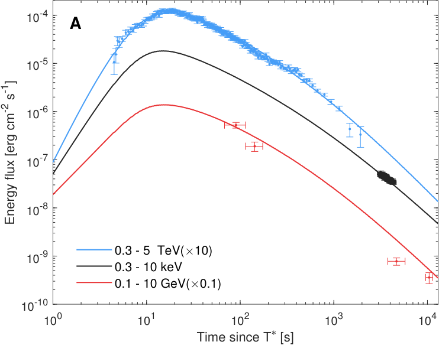

# GRB 221009A 光变曲线

## INTEGRAL/IBIS-PICsIT soft gamma-ray light curve

Rodi & Ubertini 使用 PICsIT spectral-timing data 研究 GRB 221009A 在 200–2600 keV 的 prompt 和 early afterglow 光变行为。

已整理阶段：

1. **precursor**：T0 = 13:17:00 UTC 附近出现 precursor；PICsIT 图中在 200–1200 keV 显示 fast rise 和 exponential decay，持续约 7 s。
2. **Pulse 1–4**：主 prompt phase 包含多个 pulse，覆盖约 T0 + 177 s 到 T0 + 600 s；部分 bright-pulse peak 受 telemetry gaps 影响。
3. **soft gamma-ray afterglow dominance**：afterglow emission 在约 T0 + 630 s 开始占主导。
4. **afterglow decay**：PICsIT afterglow decay slope 为 1.6 ± 0.2，至少持续到 T0 + 900 s。

## LHAASO TeV light curve 行为

LHAASO Collaboration 报告的 TeV light curve 具有以下阶段：

1. **延迟开始**：TeV photon flux 在 GRB trigger 后数分钟开始。
2. **快速上升**：flux 在开始后约 10 s 达到峰值。
3. **峰后衰减**：峰值后 TeV emission 进入衰减。
4. **衰减变快**：约峰后 650 s，衰减变快。

这些阶段来自 LHAASO 对 >0.2 TeV photon sample 的分析；该样本在最初 3000 s 内超过 64,000 个光子。

图像 provenance：从 `raw/arxiv/2306.06372/2306.06372-source.tar.gz` 中 `images/LC-multiwavelength.pdf` 渲染为 PNG；该图用于展示 TeV、X-ray 与 GeV energy flux 的相对光变形态。

## Radio / mm light curve 与 SED 图像状态

Laskar et al. source package 包含 multiwavelength light curve、radio SED 和多种模型比较图，适合后续从原始 figure 文件提取并登记：

- `figures/GRB221009A_mmlc.pdf`：multiwavelength light curve candidate。
- `figures/GRB221009A_VLA_SED_bpl.pdf`、`figures/GRB221009A_VLA_SED_singlecomp.pdf`、`figures/GRB221009A_VLA_SED_phys.pdf`、`figures/GRB221009A_VLA_SED_ISM.pdf`、`figures/GRB221009A_VLA_SED_rs.pdf`：radio SED / model comparison candidates。
- `figures/Radio_Comparison_GRB221009A.pdf`：radio comparison figure candidate。

## O'Connor et al. long-lived X-ray decay

O'Connor et al. 使用前三个月 multiwavelength afterglow evolution，并报告 X-ray brightness 以约 t^-1.66 的 power-law slope 衰减。作者认为该行为不符合 standard predictions for jetted emission，并将其解释为 shallow energy profile；本页只记录 light curve 约束，模型解释见 [模型解释](模型解释.md)。

## 图像状态

- 已嵌入一张 LHAASO multiwavelength light curve，文件位于 `figures/lhaaso-lc-multiwavelength.png`。
- INTEGRAL/PICsIT 图片应先从 `raw/arxiv/2303.16943/2303.16943-source.tar.gz` 中对应原图提取。
- Laskar et al. radio-to-GeV afterglow 图片应先从 `raw/arxiv/2302.04388/2302.04388-source.tar.gz` 中对应原图提取。
- O'Connor et al. structured jet / X-ray light curve 图片应先从 `raw/arxiv/2302.07906/2302.07906-source.tar.gz` 中对应原图提取。
- 若 source 包图像难以对应，再使用 `E:\paper_figure_extractor`；PDF crop 仅作为最后手段，并需在 [图像索引](图像索引.md) 标明 provenance。

## 相关页面

- [时间线](时间线.md)
- [余辉](余辉.md)
- [多波段数据](多波段数据.md)
- [图像索引](图像索引.md)
- [INTEGRAL / IBIS-PICsIT](../../../30_仪器/integral/index.md)

## 来源

- J. Rodi and P. Ubertini, “Soft Gamma-Ray Spectral and Time Evolution of GRB 221009A: Prompt and Afterglow Emission with INTEGRAL/IBIS-PICsIT,” A&A 677, L3 (2023), arXiv:2303.16943, DOI: 10.1051/0004-6361/202346373。
- T. Laskar et al., “The Radio to GeV Afterglow of GRB 221009A,” ApJL, arXiv:2302.04388, DOI: 10.3847/2041-8213/acbfad。
- B. O'Connor et al., “A structured jet explains the extreme GRB 221009A,” Science Advances 9, eadi1405 (2023), arXiv:2302.07906, DOI: 10.1126/sciadv.adi1405。
- LHAASO Collaboration, “A tera-electronvolt afterglow from a narrow jet in an extremely bright gamma-ray burst 221009A,” Science 380, 1390-1396 (2023), arXiv:2306.06372, DOI: 10.1126/science.adg9328。
