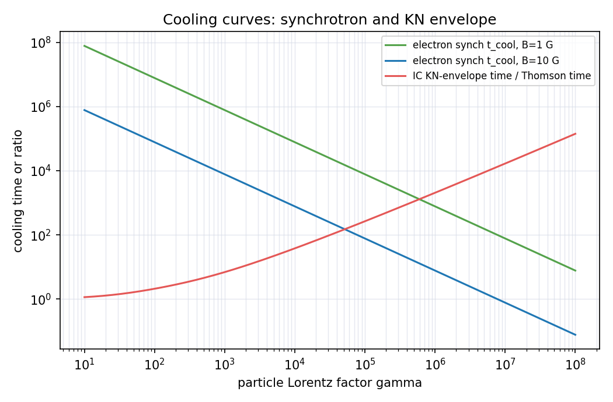
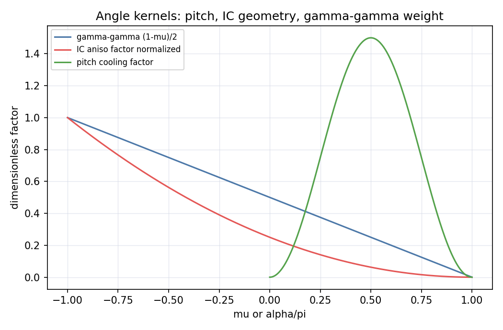
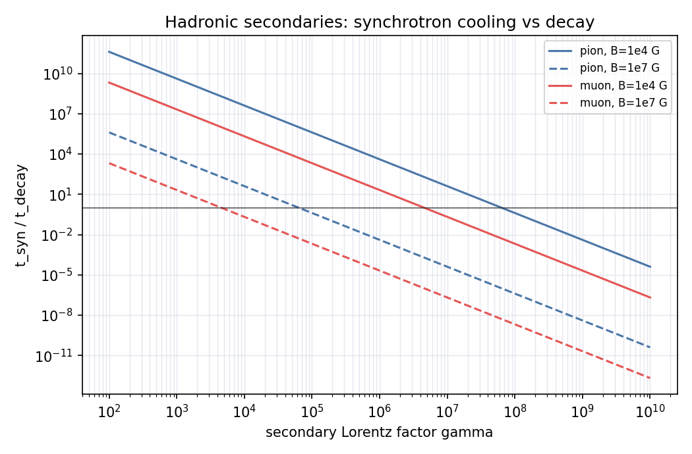

# 09 辐射机制课程完整性审计

状态：v4.8 audit。这个页面回答“哪些辐射机制已经接近课程讲义级，哪些只是代码边界或 benchmark 边界”。它不替代机制页本身。

2026-05-25 纠偏记录：source-agnostic foundation 和 accelerator screening 的 production helper 已经有 Formula ID、函数和验证结果，但原先缺少专门的物理推导/实现反馈页。现已新增 [11 Source-Agnostic Foundation and Accelerator Screening](11-source-agnostic-foundation-and-acceleration.md)。这些条目当前状态改为 `draft-derived / implementation-feedback / local-fixed-point`，不能写成完整课程推导或完整 accelerator model。

2026-05-26 补充记录：已新增 [12 缺口过程接口路线图](12-missing-process-interface-roadmap.md)，把 self-consistent SSC、anisotropic IC、\(p\gamma\)、Bethe-Heitler、EM cascade、neutrino event-rate、relativistic photosphere 和 nuclear channels 的安全理论起点、接口输入输出、benchmark route 与不能声称内容写清。它是 roadmap / interface contract，不是新增 solver。

2026-05-27 补充记录：已新增 [13 Self-Consistent SSC Transfer](13-self-consistent-ssc-transfer.md)，把 12 页中的 `RAD-GAP-SSC-INTERFACE-001` 展开为讲义级理论页。页面从 synchrotron transfer、photon balance、SSC emissivity、IC cooling feedback 和 \(Y(\gamma)\) 出发，说明当前 `ssc.py` 仍是 supplied-seed / toy-feedback 层，不是 self-consistent SSC solver。

2026-05-27 代码反馈记录：已新增第一条具体源类 adapter `AG-FS-LOCAL-ZONE-001`，把 GRB forward-shock BM state 接入 `RAD-ZONE-SCREENING-001`。这是 source-adapter smoke，不是新的辐射核，也不是 observed afterglow flux、event fit 或 self-consistent SSC transfer。

2026-05-29 补充记录：已新增 [14 各向异性 Inverse Compton 接口](14-anisotropic-inverse-compton-interface.md)，把 12 页中的 `RAD-GAP-ANISO-IC-INTERFACE-001` 展开为讲义级理论接口页。页面从 \(n_{\rm ph}(\epsilon,\Omega)\)、电子方向、electron rest-frame KN angular kernel 和 directional emissivity 积分出发，说明当前 production IC 仍是 isotropic BG/KN kernel，`anisotropic_ic_geometry_factor` 仍是 teaching-only envelope。

2026-05-29 补充记录：已新增 [15 Photohadronic 与 Bethe-Heitler 接口](15-photohadronic-and-bethe-heitler-interface.md)，把 `RAD-GAP-PGAMMA-BH-INTERFACE-001` 展开为讲义级理论接口页。页面补出 \(\mu\to\bar\epsilon\) 换元、isotropic rate integral、\(p\gamma\) secondary yield、BH loss rate、BH pair injection 和 benchmark boundary；当前代码仍只有 threshold/envelope，不是 \(p\gamma\) / BH solver。

2026-05-29 补充记录：已新增 [16 Electromagnetic Cascade Transport 接口](16-electromagnetic-cascade-transport-interface.md)，把 `RAD-GAP-CASCADE-INTERFACE-001` 展开为讲义级理论接口页。页面从 coupled \(N_\gamma,N_e\) transport、\(\gamma\gamma\) pair injection、pair cooling、secondary photon source、energy ledger 和 opacity-vs-cascade 区分出发；当前代码仍只有 \(\gamma\gamma\) opacity、local cooling arrays 和 source-term candidates，不是 EM cascade solver。

2026-05-29 补充记录：已新增 [17 Neutrino Fluence 与 Event-Rate 接口](17-neutrino-fluence-and-event-rate-interface.md)，把 `RAD-GAP-NU-EVENT-INTERFACE-001` 展开为讲义级 detector-convolution 接口页。页面区分 source neutrino yield、Earth fluence、flavor mixing、detector effective area、time window、event class、Poisson upper limit 与 non-detection claim boundary；当前代码仍没有 neutrino spectrum、flavor helper 或 event-rate predictor。

2026-05-29 补充记录：已新增 [18 Relativistic Photosphere Transfer 接口](18-relativistic-photosphere-transfer-interface.md)，把 `RAD-GAP-PHOTOSPHERE-INTERFACE-001` 展开为讲义级 moving-photosphere transfer 接口页。页面区分 static effective blackbody、baryonic photosphere radius scale、moving-medium optical-depth surface、Doppler invariant、EATS flux integral、multi-color / Comptonized spectral broadening 与 code boundary；当前代码仍没有 relativistic photospheric transfer solver。

2026-05-29 补充记录：已新增 [19 Nuclei Photodisintegration 与 Spallation 接口](19-nuclei-photodisintegration-and-spallation-interface.md)，把 P3 `nuclei / photodisintegration / spallation` 展开为讲义级 nuclear-channel 接口页。页面区分 heavy-nucleus synchrotron 的 \(Z/A\) 电磁缩放、nucleus rest-frame photon energy、photodisintegration rate、GDR threshold、fragment network、gas spallation、de-excitation gamma、survival competition 与 benchmark boundary；当前代码仍没有 nuclear cross-section table、fragment yields 或 nuclear cascade solver。

## 1. 状态标签

| 标签 | 含义 |
| --- | --- |
| `course-derived` | 已有从物理图像、基本方程、变量替换到可计算表达式的推导 |
| `teaching-code` | 有红色教学层代码，可用于课程示例或插图 |
| `production-parity` | 有绿色 production 层，并与蓝色外部库做过逐点或同 convention 对照 |
| `cooling-parity` | 冷却曲线也与外部库或成熟表格逐点对齐 |
| `angle-kernel` | 角分布、pitch-angle 或 anisotropic kernel 已明确实现并验证 |
| `missing` | 只登记边界或候选，未实现完整课程/代码 |

## 2. 当前总表

| 机制 | 课程推导 | 教学代码 | production parity | cooling parity | angle kernel | 当前判断 |
| --- | --- | --- | --- | --- | --- | --- |
| synchrotron / SSA | `course-derived` | `teaching-code` | `production-parity` with naima/agnpy | local fixed-point only | pitch-angle 与 random-field convention 已披露 | 接近课程讲义级 |
| inverse Compton | `course-derived`；anisotropic interface 已展开 | `teaching-code` | `production-parity` with naima CMB IC | local Thomson fixed-point only | isotropic BG/KN；anisotropic geometry factor 仍 teaching-only | isotropic 主干接近课程讲义级；full anisotropic solver 未完成 |
| SSC | `course-derived` for hierarchy and self-consistent interface | `teaching-code` | `production-parity` with agnpy one-zone | not complete | seed geometry / transfer convention disclosed | 理论接口更完整，仍非完整 transfer solver |
| gamma-gamma | `course-derived` for Breit-Wheeler and isotropic opacity | teaching/reference helpers | target-spectrum opacity production smoke + EBL attenuation helper parity | not applicable | isotropic angle integral only | 主干完整，source-local target spectrum 可接动力学；外部 EBL/cascade 未内置 |
| blackbody/photosphere | `course-derived`；relativistic transfer interface 已展开 | teaching/reference helpers | no external parity | local fixed-point only | no relativistic transfer solver | 主干完整，moving photosphere 仍是 theory-only interface |
| thermal free-free | `course-derived` | teaching/reference helpers | no external thermal parity | local fixed-point only | not applicable | 主干完整，relativistic/Gaunt tables 未完成 |
| nonthermal bremsstrahlung | partial derivation + mature-method disclosure | `teaching-code` simplified | `production-parity` with naima Baring99 | not complete | not applicable | 代码对齐，课程推导还可加深 |
| pp pion decay | threshold/delta + LUT boundary | `teaching-code` delta | `production-parity` with naima Kafexhiu LUT | no | not applicable | pp gamma-ray SED 有 production parity，但 neutrino/e± spectrum 未完成 |
| pγ pion production | threshold and integral formalism；yield 接口已展开 | threshold envelope | no | no | angle integral theory-only | `missing` for production spectrum |
| Bethe-Heitler | threshold and injection formalism；loss / pair-injection 接口已展开 | threshold envelope | no | no | theory-only | `missing` for pair injection/cooling table |
| proton synchrotron | mass-scaled derivation | `teaching-code` | `production-parity` with agnpy | local fixed-point only | fixed kernel only | SED parity 已有，acceleration/cooling-limit 未完成 |
| pion/muon synchrotron | decay-vs-cooling derivation | `teaching-code` | no | local fixed-point only | fixed kernel scale only | teaching/regime layer |
| nuclei / photodisintegration / spallation | reaction matrix；nuclear network interface 已展开 | limited nuclei synch helper | no | no | no | `missing` for full spectra / network solver |
| hadronic / EM cascade / neutrino event rate | EM cascade 与 neutrino event-rate interfaces 已展开 | no full helper | no | no | transport / detector response required | `missing` for solver / predictor，不能声称完成 |

## 3. 当前缺口优先级

已经完成的优先级不再列为下一步。当前真正的缺口是：

| Priority | 缺口 | 当前已有 | 下一步边界 |
| --- | --- | --- | --- |
| P1 | self-consistent SSC transfer | SSC formal integral、one-zone benchmark、\(Y\) toy feedback | 需要 seed photon transfer、SSA、escape、KN cooling 共同求解 |
| P1 | full anisotropic IC | isotropic BG/KN kernel、teaching geometry factor；14 页已补理论接口 | 下一步才是成熟 anisotropic kernel 或 benchmark route |
| P1 | \(p\gamma\) / Bethe-Heitler spectra | threshold、rate / injection formal integral；15 页已补接口推导 | 需要 SOPHIA / NeuCosmA / AM3 或文献参数化接口 |
| P1 | EM cascade solver | transport skeleton、opacity kernel；16 页已补 EM cascade 接口 | 需要 photon-pair coupled transport |
| P2 | neutrino event-rate pipeline | source fluence / flavor / detector convolution 接口已展开 | 需要 detector effective area、time window、event class 与外部数据产品 |
| P2 | relativistic photosphere / thermal transfer | blackbody / photosphere scale；18 页已补 moving-transfer 接口 | 需要 optical-depth surface、Doppler/EATS integration、heating/opacity closure 与 benchmark route |
| P2 | nonthermal brems cooling parity | naima SED parity、loss envelope | 需要成熟 loss-rate benchmark |
| P3 | nuclei / photodisintegration / spallation spectra | reaction matrix；19 页已补 nuclear network 接口 | 需要 nuclear cross-section tables、fragment yields、transport network 与 cascade coupling |

## 4. 不混淆规则

- 绿色 production 不是自动代表“物理唯一正确”，只代表某个明确 convention 下可用于计算。
- 红色 teaching 不要求逐点等于外部库，但必须能解释差异来源。
- 蓝色 external benchmark 不进入 `core/radiation`，也不能写成事件结论。
- `missing` 不是失败，而是明确告诉后续 agent 不要把空白写成已完成。

## 5. Cooling / Angle-kernel v1 状态

| 机制 | cooling 状态 | angle-kernel 状态 | 本轮判断 |
| --- | --- | --- | --- |
| synchrotron | `production-ready / local-fixed-point`，已有 `t_syn` 与 `gamma_c` | `local-fixed-point` for isotropic pitch averages；polarization/transfer missing | 可接动力学的一阶 cooling |
| IC | Thomson cooling `production-ready`；KN cooling 是 envelope | isotropic BG/KN production；anisotropic factor 为 `teaching-only` | 不能声称 full anisotropic solver |
| SSC | `teaching-only` `Y P_syn` envelope | one-zone seed geometry disclosed | 不能声称 self-consistent transfer |
| gamma-gamma | not applicable as particle cooling | isotropic angle-average numerical kernel | EBL 仍由外部 table/model 给出 |
| thermal free-free | `local-fixed-point / order-of-magnitude` | not applicable | 无 external thermal parity |
| nonthermal bremsstrahlung | `order-of-magnitude / external-unavailable` loss envelope | not applicable | SED parity 有；cooling 只能做动力学 envelope |
| pp | `order-of-magnitude` loss time | not applicable | 只作 proton loss envelope |
| pγ / Bethe-Heitler | threshold envelope only；rate/yield/loss/pair-injection 是 theory-only 接口 | interaction angle theory-only | production spectrum/cooling table missing |
| pion/muon secondary | `teaching-only` cooling-vs-decay regime | fixed synch scale only | 无 secondary spectrum |

## 6. 可视化输出 v1.1

为了让审计页不只停留在文字状态，本轮新增三张 cooling / angle 诊断图：

| 输出 | 文件 | 含义 |
| --- | --- | --- |
| cooling curves | `reproduce/grb/validation_lab/outputs/figures/radiation_cooling_curves_v1.png` | electron synch cooling、不同 B 场、IC KN envelope 与 Thomson 的差异 |
| angle kernels | `reproduce/grb/validation_lab/outputs/figures/radiation_angle_kernels_v1.png` | pitch-angle cooling factor、IC head-on/tail-on teaching factor、gamma-gamma angle weight |
| hadronic secondary regime | `reproduce/grb/validation_lab/outputs/figures/radiation_hadronic_secondary_regime_v1.png` | pion/muon 的 \(t_{\rm syn}/t_{\rm dec}\) 随 \(\gamma\) 和 B 的变化 |

对应表格为 `reproduce/grb/validation_lab/outputs/tables/radiation_cooling_angle_v1_checks.csv`。这些输出仍然不是事件拟合，也不是完整外部 cooling parity；它们的作用是把后续动力学最需要的 loss/angle convention 先固定下来。







## 7. 验证强度矩阵

这里把“正确”拆成四层，防止把不同验证等级混在一起：

| 验证层级 | 含义 | 当前代表结果 | 可以声称 | 不能声称 |
| --- | --- | --- | --- | --- |
| `package-compatible parity` | 本地绿色代码逐点复刻某个外部库 convention | naima synch/IC/brems/pion、agnpy synch/SSC/proton synch、ebltable attenuation | 同一参数和同一 convention 下数值对齐 | 这是唯一物理标准 |
| `numerical-kernel` | 核函数、角积分或谱核的数值行为通过极限检查 | gamma-gamma angle average、Breit-Wheeler、synchrotron kernel | 核函数在定义范围内可用 | 已完成 full transfer/cascade |
| `local-fixed-point` | 解析标度、单调性、极限行为通过 | \(P_{\rm syn}\)、\(P_{\rm IC}\)、\(\gamma_c\)、free-free cooling、pitch averages | 公式方向、量纲和极限正确 | 已与外部 cooling API 逐点对齐 |
| `teaching-only / envelope` | 用来画 regime 图或给动力学上界/下界 | KN cooling envelope、SSC \(YP_{\rm syn}\)、pγ/BH threshold、pion/muon cooling-vs-decay | 可作教学和候选筛选 | 完整谱、完整 cooling table、事件结论 |
| `source-agnostic foundation` | 不绑定 GRB/AGN/SNR/PWN 的局域场量和数组接口 | `fields.py`、`evaluate_electron_cooling_curve()`；推导反馈页 `11-source-agnostic-foundation-and-acceleration.md` | 可作为多源模型的共同底座；当前为 `draft-derived / implementation-feedback` | 已完成几何、transport 或源类模型 |

## 8. 本轮实际通过的 cooling / angle 检查

| 机制 | 检查 | 实测 | 期望 | 状态 | 验证层级 |
| --- | --- | --- | --- | --- | --- |
| synchrotron | \(P_{\rm syn}\propto\gamma^2\) | 4.0 | 4.0 | pass | local-fixed-point |
| synchrotron | \(t_{\rm syn}\propto B^{-2}\) | 4.0 | 4.0 | pass | local-fixed-point |
| inverse Compton | Thomson \(P_{\rm IC}\propto\gamma^2\) | 4.0 | 4.0 | pass | local-fixed-point |
| inverse Compton | KN cooling suppression | \(5.97\times10^{-5}\) | < 1 | pass | local-fixed-point envelope |
| cooling break | \(\gamma_c\propto t^{-1}\) | 10.0 | 10.0 | pass | local-fixed-point |
| thermal free-free | density cooling trend | 0.01 | < 1 | pass | local-fixed-point |
| thermal free-free | \(t_{\rm ff}\propto T^{1/2}\) | 2.0 | 2.0 | pass | local-fixed-point |
| nonthermal brems | loss time density inverse | 10.0 | 10.0 | pass | order-of-magnitude |
| pp | loss time density inverse | 10.0 | 10.0 | pass | order-of-magnitude |
| photohadronic | BH threshold below pγ threshold | 0.0032 | < 1 | pass | teaching-only |
| pion secondary | stronger B reduces \(t_{\rm syn}/t_{\rm dec}\) | \(10^{-8}\) | < 1 | pass | teaching-only |
| pitch angle | \(\langle\sin\alpha\rangle,\langle\sin^2\alpha\rangle\) | \(\pi/4,2/3\) | analytic | pass | local-fixed-point |
| IC angle | head-on greater than tail-on | \(1.6\times10^9\) | > 1 | pass | teaching-only |
| gamma-gamma angle | head-on / angle-average finite | 1.0365 | positive finite | pass | numerical-kernel |

完整机器可读表在 `reproduce/grb/validation_lab/outputs/tables/radiation_cooling_angle_v1_checks.csv`。

## 9. Source-Agnostic Radiation Foundation v1

本轮把辐射基础层从 GRB 语境中抽出来，新增 `reproduce/grb/core/radiation/fields.py`。它提供高能天体物理源通用的局域场接口。对应物理推导/实现反馈页为 [11 Source-Agnostic Foundation and Accelerator Screening](11-source-agnostic-foundation-and-acceleration.md)，当前状态是 `draft-derived / implementation-feedback`，不是完整 source-model 课程页。

| 机制/接口 | Formula ID | 函数/类 | 输入单位 | 输出单位 | 验证等级 |
| --- | --- | --- | --- | --- | --- |
| magnetic field container | `RAD-FIELD-MAGNETIC-001` | `MagneticField` | gauss | `U_B` in erg cm^-3 | local-fixed-point |
| isotropic photon field | `RAD-FIELD-PHOTON-001` | `IsotropicPhotonField` | `U_ph` in erg cm^-3；可选 characteristic energy in eV | convention container | production-smoke |
| tabulated photon energy density | `RAD-FIELD-PHOTON-U-TABULATED-001` | `photon_energy_density_from_tabulated_field()` | energy grid in eV；`n_epsilon` in cm^-3 erg^-1 | erg cm^-3 | numerical-kernel |
| uniform local zone | `RAD-ZONE-UNIFORM-001` | `UniformRadiationZone` | local `B`、`U_ph`、可选 path length | local field state | production-smoke |
| electron cooling curve | `RAD-COOL-ELECTRON-CURVE-001` | `evaluate_electron_cooling_curve()` | gamma grid；B in gauss；`U_ph` in erg cm^-3 | powers in erg s^-1；times in s | local-fixed-point |
| electron cooling time-series | `RAD-COOL-ELECTRON-TIMESERIES-001` | `evaluate_electron_cooling_timeseries()` | time grid in s；gamma grid；`B(t)` in gauss；`U_ph(t)` in erg cm^-3 | rows with time, powers, times | local-fixed-point |
| accelerator screening | `ACC-HILLAS-ENERGY-001`, `ACC-BOHM-TIME-001`, `ACC-ELECTRON-SYN-LIMIT-GAMMA-001` | `hillas_max_energy()`、`bohm_acceleration_time()`、`electron_synchrotron_loss_limited_gamma_max()` | B in gauss；R in cm；mass in g；gamma dimensionless | eV、seconds、dimensionless gamma | local-fixed-point |
| local-zone screening workbench | `RAD-ZONE-SCREENING-001` | `evaluate_local_zone_screening_summary()` | per-zone local `B`、`R`、`U_ph`、optional seed energy | one summary row per zone | local-fixed-point / production-smoke |
| local gamma-gamma opacity workbench | `RAD-ZONE-GG-TABULATED-OPACITY-SCREEN-001` | `evaluate_local_gamma_gamma_opacity_screening()` | gamma grid in keV；target grid in keV；target density in cm^-3 keV^-1；path length in cm | \(\alpha_{\gamma\gamma}\) in cm^-1；\(\tau\)；attenuation | numerical-kernel / local-fixed-point / production-smoke |

新增验证入口：

```powershell
python -m reproduce.grb.validation_lab.check_radiation_foundation_v1
```

输出：

| 输出 | 文件 | 含义 |
| --- | --- | --- |
| foundation checks | `reproduce/grb/validation_lab/outputs/tables/radiation_foundation_v1_checks.csv` | blackbody \(U=aT^4\)、\(U_B\propto B^2\)、cooling time 比例和 KN envelope |
| cooling curve table | `reproduce/grb/validation_lab/outputs/tables/radiation_foundation_cooling_curve_v1.csv` | electron gamma grid 上的 `P_syn`、`P_IC`、`t_syn`、`t_IC`、total cooling |
| cooling time-series table | `reproduce/grb/validation_lab/outputs/tables/radiation_foundation_cooling_timeseries_v1.csv` | `B(t)\propto t^{-1/2}`、`U_ph(t)\propto t^{-1}` 下的 cooling time-series |
| comparison figure | `reproduce/grb/validation_lab/outputs/figures/radiation_foundation_cooling_curves_v1.png` | cooling curve 与固定点比例比较 |


课程差异说明：这里实现的是局域 cgs 场量、gamma-grid 数组接口和 time-series 包装；第 11 页已经把 \(U_B=B^2/8\pi\)、\(U_{\rm ph}=\int \epsilon n_\epsilon d\epsilon\)、Thomson cooling time 和 time-series fixed-point 标度写清。但它仍不是完整 radiative transfer，也不从观测 flux 反演 photon density。`characteristic_seed_photon_energy_ev` 只服务 KN envelope；完整 IC/opacity 仍应使用 tabulated photon field 和对应 kernel。time-series 接口只消费调用方提供的 `B(t)` 和 `U_ph(t)`，不解动力学或粒子输运。

本轮新增 `RAD-ZONE-SCREENING-001` / `evaluate_local_zone_screening_summary()`，用于把一个局域区的 `B,R,U_ph` 合成 field/cooling/acceleration summary。它是 future source adapters 的共同桥，不是任何具体 GRB/AGN/PWN/SNR 模型；调用方必须记录这些局域量的来源。

第一条具体调用方是 GRB forward shock local-zone adapter：

| 机制/接口 | Formula ID | 函数 | 输入单位 | 输出单位 | 验证等级 |
| --- | --- | --- | --- | --- | --- |
| forward-shock local-zone adapter | `AG-FS-LOCAL-ZONE-001` | `forward_shock_local_zone_state()`、`forward_shock_local_zone_series()`、`forward_shock_radiation_screening_summary()` | observer time in s；radius/local size in cm；B in gauss；energy density in erg cm^-3 | local states plus screening rows; cooling/escape times in s; energies in eV | literature-scale candidate / source-adapter smoke |
| forward-shock cooling / acceleration time series | `AG-FS-COOL-ACC-SCREEN-001` | `forward_shock_cooling_acceleration_timeseries()` | time grid in s；probe Lorentz factors dimensionless；B in gauss；size in cm；energy density in erg cm^-3 | cooling / acceleration / escape times in s；Hillas energies in eV；ceilings dimensionless | literature-scale candidate / source-adapter smoke / BM slope propagation |
| forward-shock gamma-gamma opacity screen | `AG-FS-GG-OPACITY-SCREEN-001` | `forward_shock_gamma_gamma_opacity_screening()` | time grid in s；gamma energy in keV；mono seed energy in eV；\(U'_{\rm ph}\) envelope in erg cm^-3；path length in cm | target density in cm^-3；\(\alpha_{\gamma\gamma}\) in cm^-1；\(\tau_{\gamma\gamma}\) dimensionless；attenuation | literature-scale candidate / source-adapter smoke / local-fixed-point |
| forward-shock tabulated target opacity screen | `AG-FS-GG-TARGET-SPECTRUM-SCREEN-001` | `forward_shock_gamma_gamma_target_spectrum_screening()` | time grid in s；gamma energy in keV；target grid in keV；target shape per keV；\(U'_{\rm ph}\) envelope；path length in cm | normalized target density in cm^-3 keV^-1；\(\alpha_{\gamma\gamma}\) in cm^-1；\(\tau\)；attenuation | literature-scale candidate / source-adapter smoke / local-fixed-point |

课程差异说明：该 adapter 采用 \(R'_{\rm screen}=f_RR/\Gamma\) 和 \(U'_{\rm ph}=f_{\rm ph}e'\)。它只验证 BM 幂律、单位和 workbench 包装层，不解 photon transfer、EATS、观测 flux 或事件参数。`AG-FS-GG-OPACITY-SCREEN-001` 进一步把 \(n'_{\rm target}=U'_{\rm ph}/\epsilon'_{\rm seed}\) 接到 `GG-ABS-COEFF-MONO-001`，只做 mono target envelope；`AG-FS-GG-TARGET-SPECTRUM-SCREEN-001` 把 caller-supplied target shape 归一化到同一个 \(U'_{\rm ph}\) envelope 后接 `RAD-ZONE-GG-TABULATED-OPACITY-SCREEN-001`。二者都不声称 self-consistent SSC photon field、完整 source opacity、EBL 或 cascade。

## 10. Source-Agnostic Accelerator Foundation v1

本轮新增 `reproduce/grb/core/radiation/acceleration.py`，只做源类无关的第一筛。对应物理推导/实现反馈页为 [11 Source-Agnostic Foundation and Accelerator Screening](11-source-agnostic-foundation-and-acceleration.md)，并与 afterglow 的 `11-particle-acceleration-and-maximum-energy.md` 互相呼应；本页状态仍是 `draft-derived / source-screening`。

| 机制/接口 | Formula ID | 函数 | 输入单位 | 输出单位 | 验证等级 |
| --- | --- | --- | --- | --- | --- |
| Larmor radius | `ACC-LARMOR-RADIUS-001` | `particle_larmor_radius_cm()` | gamma, mass in g, B in gauss | cm | local-fixed-point |
| Bohm-like acceleration time | `ACC-BOHM-TIME-001` | `bohm_acceleration_time()` | gamma, mass, B, gyro factor | s | local-fixed-point |
| Hillas energy | `ACC-HILLAS-ENERGY-001` | `hillas_max_energy()` | B in gauss, size in cm, Z, beta | eV | source-screening |
| confinement gamma | `ACC-HILLAS-GAMMA-001` | `confinement_max_gamma()` | mass, B, size | dimensionless | local-fixed-point |
| escape time | `ACC-ESCAPE-LIGHT-TIME-001`, `ACC-ESCAPE-BOHM-DIFFUSION-001` | `light_crossing_escape_time()`、`bohm_diffusion_escape_time()` | size, gamma, mass, B | s | envelope |
| electron synchrotron loss limit | `ACC-ELECTRON-SYN-LIMIT-GAMMA-001` | `electron_synchrotron_loss_limited_gamma_max()` | B, gyro factor | gamma | local-fixed-point |

新增输出：

| 输出 | 文件 | 含义 |
| --- | --- | --- |
| acceleration checks | `reproduce/grb/validation_lab/outputs/tables/radiation_acceleration_v1_checks.csv` | Hillas/Bohm/escape/synch-loss fixed-point ratios |
| acceleration scan | `reproduce/grb/validation_lab/outputs/tables/radiation_acceleration_limit_scan_v1.csv` | B-R source-screening grid |
| acceleration figure | `reproduce/grb/validation_lab/outputs/figures/radiation_acceleration_limits_v1.png` | Hillas curves + fixed-point ratios |
| local-zone workbench summary | `reproduce/grb/validation_lab/outputs/tables/radiation_source_workbench_v1_summary.csv` | caller-supplied local zones 的 field/cooling/acceleration summary |
| local-zone workbench figure | `reproduce/grb/validation_lab/outputs/figures/radiation_source_workbench_v1.png` | cooling/Hillas/workbench fixed-point comparison |


不能声称：完整 shock acceleration、reconnection、turbulence spectrum、particle transport、interaction-limited maximum energy、UHECR source proof。第 11 页只推导了 \(r_L\)、Bohm-like \(t_{\rm acc}\)、Hillas confinement、light/Bohm escape envelope 和 electron synchrotron-loss ceiling；一般 \(E_{\max}\) 仍需要完整 timescale competition 和 source adapter。

## 11. Gamma-Gamma Target Spectrum Production v1.1

本轮把已在课程页登记的 `GG-ABS-COEFF-MONO-001` 与 `GG-ABS-COEFF-TABULATED-001` 接入绿色 production 层：

| 函数 | 输入单位 | 输出单位 | 验证等级 | 课程差异说明 |
| --- | --- | --- | --- | --- |
| `gamma_gamma_monoenergetic_absorption_coefficient_cgs()` | `E_gamma, epsilon_target` in keV；`n_target` in cm^-3 | cm^-1 | numerical-kernel / smoke | 各向同性、均匀、单能 target field；不是 EBL |
| `gamma_gamma_target_spectrum_absorption_coefficient_cgs()` | `E_gamma` 与 target grid in keV；`n(epsilon)` in cm^-3 keV^-1 | cm^-1 | numerical-kernel / fixed-point | 实现课程的各向同性 angle + spectrum integral；target spectrum 由调用方给出 |
| `gamma_gamma_target_spectrum_optical_depth()` | 上述输入 + `path_length_cm` | dimensionless tau | local-fixed-point | 只做 `tau=alpha*l`；不是几何/红移积分 |
| `evaluate_gamma_gamma_target_spectrum_opacity_curve()` | gamma-ray grid in keV；target spectrum；path length | rows: alpha, tau, attenuation | production-suite smoke | 批量包装，不改变物理核 |

验证入口仍是 `python -m reproduce.grb.validation_lab.check_radiation_production_suite_v1`。新增检查覆盖：曲线有限正值、`tau` 随路径长度线性、`alpha` 随 target density 线性、零密度给零 opacity。

不能声称：从 observed SED 自动反演 target photon field、采用某个 EBL model、完成空间依赖 transfer、完成 pair cascade。

## 12. 仍然没有完成的内容

这些不是“结果错了”，而是本地还没有对应完整求解器：

| 缺口 | 当前状态 | 下一步要做什么 |
| --- | --- | --- |
| full anisotropic IC | 理论接口已展开；代码仍 `missing`，只有 teaching geometry factor | 引入完整 anisotropic IC kernel 或选择成熟库作 benchmark |
| self-consistent SSC cooling | `teaching-only` \(YP_{\rm syn}\) envelope | 解 synchrotron photon density、escape time、SSA feedback、KN feedback |
| nonthermal brems cooling parity | `external-unavailable`，只有 loss envelope | 找到成熟 loss-rate API 或文献表格作逐点对照 |
| pγ cooling table | theory interface 已展开；代码仍 threshold envelope only | 引入 SOPHIA/NeuCosmA/AM3 或文献参数化 |
| Bethe-Heitler pair injection | theory interface 已展开；代码仍 formal expression only | 实现 pair injection / loss-rate table 或外部 benchmark |
| hadronic / EM cascade | theory interface 已展开；代码仍 `missing` | transport solver / cascade code；不能由当前 helper 替代 |
| neutrino event-rate pipeline | detector-convolution interface 已展开；代码仍 `missing` | detector effective area、time window、event class、likelihood；不能由 non-detection narrative 替代 |
| relativistic photosphere transfer | moving-transfer interface 已展开；代码仍只有 static blackbody 与 baryonic radius scale | optical-depth surface、Doppler/EATS integral、opacity/heating closure 与 photosphere benchmark |
| nuclei / photodisintegration / spallation | nuclear-channel interface 已展开；代码仍只有 \(Z/A\) synchrotron scale | cross-section tables、fragment-yield network、gas spallation source terms、de-excitation gamma 和 cascade coupling |
