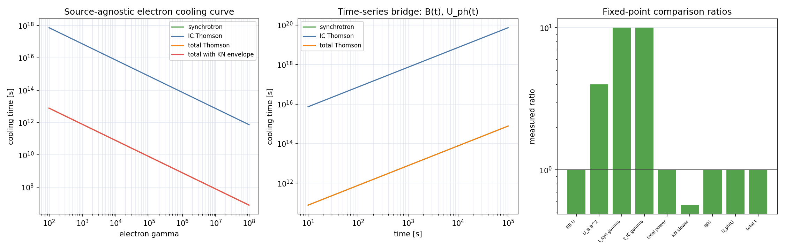
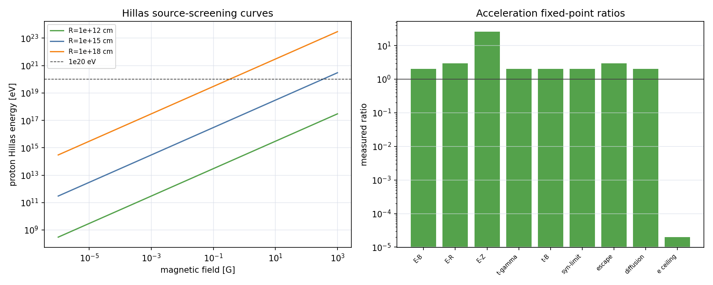
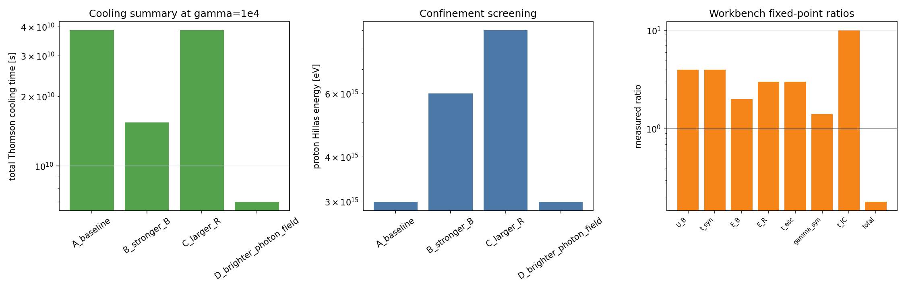

# 11 Source-Agnostic Foundation and Accelerator Screening

状态：v0.1 draft-derived / implementation-feedback。本文是代码实现反馈到理论页的补洞页，不替代 `00`、`01`、`02`、`03` 或 afterglow acceleration 章节。它只把已经进入绿色 production 层的 source-agnostic 局域场、cooling array 和第一筛 accelerator helpers 对应到公式、单位、验证等级和课程差异。

本页的核心边界很重要：这些 helper 是所有高能天体物理源可复用的局域物理底座，可被 GRB、AGN、PWN、SNR、TDE、compact merger afterglow 等源类 adapter 调用；但它们不是完整源类模型、不是 radiative-transfer solver、不是 shock/reconnection/turbulence acceleration solver，也不是 UHECR、cascade 或 neutrino 证明。

## 1. Agent Gate / 本页职责

本页由代码实现主线触发，按规则模拟调用：

| 角色 | 本页任务 |
| --- | --- |
| `literature-course-agent` | 确认这些公式属于 textbook / literature fixed-point 层，而不是事件拟合结论 |
| `derivation-agent` | 给出最小可复现推导和 exact analytic status |
| `implementation-agent` | 对接 `fields.py`、`acceleration.py`、`production.py` 的 Formula ID 和单位 |
| `verification-agent` | 标记验证等级、课程差异、不能声称什么 |

Formula ID 的规则：凡是进入 `reproduce/grb/core/radiation/production.py` 的新增物理 helper，必须在本文或更完整机制页中能找到推导/状态说明。如果只是包装已有公式，也必须写出包装层的输入输出单位和不能声称范围。

## 2. 通用局域场：从能量密度到代码容器

### 2.1 General expression

在一小块 comoving 或 local lab zone 中，radiation helper 只需要局域场量：

```text
B,  U_B,  n_ph(epsilon),  U_ph,  R_or_l
```

它不关心这些量来自 GRB forward shock、AGN blob、PWN bubble 还是 SNR shell。源类 adapter 负责把几何、Doppler、redshift、dynamics、observed flux inversion 转换成这些局域量。

### 2.2 Magnetic energy density

在 cgs Gaussian units 中，电磁场能量密度为

\[
u_{\rm EM}={E^2+B^2\over 8\pi}.
\]

对 magnetostatic 或 plasma rest-frame magnetic-field helper，取 electric contribution 不进入该局域接口，得到

\[
U_B={B^2\over 8\pi}.
\]

这就是 `RAD-FIELD-MAGNETIC-001`。若 \(B\rightarrow aB\)，则 \(U_B\rightarrow a^2U_B\)，因此 fixed-point 验证用双倍磁场得到四倍能量密度。

### 2.3 Photon-field energy density

令 \(n_\epsilon(\epsilon)\) 是每单位体积、每单位能量的 photon number density：

\[
n_\epsilon(\epsilon)={dN_\gamma\over dV\,d\epsilon}.
\]

体积元中能量区间 \([\epsilon,\epsilon+d\epsilon]\) 的 photon 数为 \(n_\epsilon d\epsilon dV\)，能量为 \(\epsilon n_\epsilon d\epsilon dV\)。除以 \(dV\) 并积分：

\[
U_{\rm ph}=\int_0^\infty \epsilon n_\epsilon(\epsilon)\,d\epsilon.
\]

若代码输入 photon energy grid 用 eV，而 `n_epsilon` 的单位是 \({\rm cm^{-3}\,erg^{-1}}\)，实现必须先将 \(\epsilon_{\rm eV}\) 转为 \(\epsilon_{\rm erg}\)，再对 \(\epsilon_{\rm erg} n_\epsilon\) 积分。这个约定对应 `RAD-FIELD-PHOTON-U-TABULATED-001`。

`RAD-FIELD-PHOTON-001` 只是保存 \(U_{\rm ph}\) 和可选 characteristic seed energy 的容器。characteristic energy 只服务 KN envelope 或教学边界，不能替代完整 \(n_\epsilon\)。

### 2.4 Uniform local zone

Uniform zone helper 只把局域状态收在一个对象中：

\[
\mathcal Z=\{B, U_B, U_{\rm ph}, \epsilon_{\rm char}, l\}.
\]

在 Thomson-like cooling 中，电子损失只需要总能量密度

\[
U_{\rm cool}=U_B+U_{\rm ph}.
\]

这对应 `RAD-ZONE-UNIFORM-001` 和 `RAD-ZONE-THOMSON-U-001`。这里的 \(l\) 是 path-length convention，只有调用 opacity 或 escape helper 时才使用；它不是源几何求解器。

## 3. Electron cooling curve / time-series bridge

### 3.1 General expression

局域电子能量为 \(E_e=\gamma m_ec^2\)。若损失功率为 \(P(\gamma,t)\)，cooling time 定义为

\[
t_{\rm cool}(\gamma,t)={\gamma m_ec^2\over P(\gamma,t)}.
\]

在 isotropic pitch-angle / Thomson helper 层，常用同步和 IC cooling powers 为

\[
P_{\rm syn}={4\over 3}\sigma_T c U_B\gamma^2,
\]

\[
P_{\rm IC,T}={4\over 3}\sigma_T c U_{\rm ph}\gamma^2.
\]

总 Thomson-like cooling power 是功率相加：

\[
P_{\rm tot,T}=P_{\rm syn}+P_{\rm IC,T}.
\]

因此

\[
t_{\rm syn}\propto {1\over U_B\gamma},\qquad
t_{\rm IC,T}\propto {1\over U_{\rm ph}\gamma}.
\]

### 3.2 Detailed derivation block

同步/Thomson IC 的共同形式来自 relativistic particle 在各向同性场中的辐射损失。写成能量变化率：

\[
{dE_e\over dt}=-P=-{4\over3}\sigma_T c U \gamma^2,
\]

其中 \(U\) 对同步为 \(U_B\)，对 Thomson IC 为 \(U_{\rm ph}\)。又因为

\[
E_e=\gamma m_ec^2,\qquad {dE_e\over dt}=m_ec^2 {d\gamma\over dt},
\]

所以

\[
{d\gamma\over dt}=-{4\sigma_T U\over3m_ec}\gamma^2.
\]

定义瞬时 cooling time 为 \(\gamma/|d\gamma/dt|\)，得到

\[
t_{\rm cool}={3m_ec\over4\sigma_TU\gamma}.
\]

如果 \(U=U_B+U_{\rm ph}\)，则

\[
t_{\rm tot,T}={3m_ec\over4\sigma_T(U_B+U_{\rm ph})\gamma}.
\]

代码中 `electron_cooling_curve()` 对每个 \(\gamma_i\) 计算上述 scalar power/time；`electron_cooling_timeseries()` 对每个 \((t_j,\gamma_i)\) 逐点调用同一公式。

### 3.3 Time-series wrapper 的可验证标度

若调用方给出

\[
B(t)=B_0(t/t_0)^{-1/2},
\]

则

\[
U_B(t)\propto B(t)^2\propto t^{-1},
\qquad
t_{\rm syn}(\gamma={\rm const})\propto t.
\]

若

\[
U_{\rm ph}(t)=U_{{\rm ph},0}(t/t_0)^{-1},
\]

则

\[
t_{\rm IC,T}(\gamma={\rm const})\propto t.
\]

这就是 `RAD-COOL-ELECTRON-TIMESERIES-001` 的 fixed-point 验证。注意它只验证 wrapper 和单位，不证明 \(B(t)\) 或 \(U_{\rm ph}(t)\) 的物理来源正确。

### 3.4 KN envelope 差异说明

本地 foundation helper 允许传入 characteristic seed photon energy，用一个 KN suppression envelope 让 high-\(\gamma\) IC cooling 比 Thomson 慢。这不是 Blumenthal-Gould 完整 cooling integral，也不是 anisotropic IC。完整 IC 谱核仍属于 `02-inverse-compton-and-ssc.md` 中的 BG/KN kernel 路线。

## 4. Source-agnostic accelerator screening

### 4.1 General expression: timescale competition

粒子最大能量一般不是单个 Hillas 条件决定，而是由 timescale competition 决定：

\[
t_{\rm acc}(E)=\min(t_{\rm dyn},t_{\rm esc},t_{\rm syn},t_{\rm IC},t_{pp},t_{p\gamma},t_{\rm BH},\ldots).
\]

本页 production helper 只实现其中最基础的 confinement、Bohm-like acceleration、escape envelope 和 electron synchrotron-loss ceiling。它不实现 shock obliquity、reconnection rate、turbulence spectrum、particle transport 或 hadronic interaction loss table。

### 4.2 Relativistic Larmor radius

对 charge \(Ze\)、质量 \(m\)、Lorentz factor \(\gamma\) 的 relativistic particle，动量近似为

\[
p\simeq \gamma mc.
\]

Larmor radius 来自 Lorentz force 提供向心力：

\[
{pv\over r_L}={Ze\over c}vB.
\]

约去 \(v\) 得

\[
r_L={pc\over ZeB}\simeq {\gamma mc^2\over ZeB}.
\]

这对应 `ACC-LARMOR-RADIUS-001`，单位为 cm。它是 ultra-relativistic screening formula；非相对论粒子应使用 \(p\) 而非 \(\gamma mc\)。

### 4.3 Bohm-like acceleration time

把一个 gyro radius 附近的散射/回旋时间作为最快数量级，定义

\[
t_{\rm acc}=\eta_{\rm acc}{r_L\over c}.
\]

代入上式：

\[
t_{\rm acc}=\eta_{\rm acc}{\gamma mc\over ZeB}.
\]

这对应 `ACC-BOHM-TIME-001`。\(\eta_{\rm acc}\ge1\) 是 phenomenological gyro factor，不是由当前代码求出的 shock/reconnection microphysics。

### 4.4 Hillas confinement energy

Confinement 要求粒子 gyro radius 不超过 accelerator 尺度 \(R\)：

\[
r_L\lesssim \beta R.
\]

代入 \(r_L=E/(ZeB)\) 的 ultra-relativistic cgs 形式，得到

\[
E_{\max}\lesssim ZeB\beta R.
\]

转换成 eV：

\[
E_{\max,{\rm eV}}={ZeB\beta R\over 1.602176634\times10^{-12}}.
\]

这就是 `ACC-HILLAS-ENERGY-001`。对应 Lorentz-factor ceiling 为

\[
\gamma_{\max,{\rm conf}}={E_{\max}\over mc^2},
\]

即 `ACC-HILLAS-GAMMA-001`。它只说明“装得下”，不说明“加速得上去”。

### 4.5 Escape envelopes

几何 light-crossing envelope：

\[
t_{\rm esc,light}={R\over c}.
\]

Bohm diffusion coefficient 的量级为

\[
D_{\rm Bohm}\simeq {1\over3}r_Lc.
\]

一维 random-walk escape time 的 envelope 可写成

\[
t_{\rm esc,diff}\sim {R^2\over 2D_{\rm Bohm}}
={3R^2\over2r_Lc}.
\]

这对应 `ACC-ESCAPE-LIGHT-TIME-001` 和 `ACC-ESCAPE-BOHM-DIFFUSION-001`。常数 \(2\) 或 \(6\) 的选择依赖几何维度和边界条件；本地 helper 明确标为 envelope-fixed-point。

### 4.6 Electron synchrotron-loss-limited gamma

令 Bohm-like acceleration time 等于 electron synchrotron cooling time：

\[
\eta_{\rm acc}{\gamma m_ec\over eB}
=
{6\pi m_ec\over \sigma_TB^2\gamma}.
\]

约去 \(m_ec\)，得

\[
\eta_{\rm acc}{\gamma\over eB}
=
{6\pi\over \sigma_TB^2\gamma}.
\]

整理：

\[
\gamma_{\max}^2={6\pi e\over \eta_{\rm acc}\sigma_TB},
\]

\[
\gamma_{\max}=\left({6\pi e\over \eta_{\rm acc}\sigma_TB}\right)^{1/2}.
\]

这对应 `ACC-ELECTRON-SYN-LIMIT-GAMMA-001`。它忽略 IC loss、escape、source age、pitch-angle factor、radiation reaction refinements 和 spatial transport，只能作为 electron synchrotron loss ceiling。

## 5. Exact analytic status

| 项 | 解析状态 |
| --- | --- |
| \(U_B=B^2/8\pi\) | exact within cgs local magnetic-field convention |
| \(U_{\rm ph}=\int\epsilon n_\epsilon d\epsilon\) | exact definition for local photon energy density；数值积分误差来自网格 |
| Thomson cooling power | exact within classical Thomson / isotropic-field / ultra-relativistic convention |
| KN envelope | approximation；不是 exact IC cooling integral |
| Larmor radius | exact for local uniform \(B\) if using exact momentum；代码用 ultra-relativistic \(p\simeq\gamma mc\) |
| Bohm acceleration time | phenomenological lower-envelope model |
| Hillas confinement | geometric necessary condition，not sufficient condition |
| Bohm diffusion escape | envelope approximation，constant depends on geometry |
| electron synch-loss ceiling | analytic limit from \(t_{\rm acc}=t_{\rm syn}\)，but ignores other losses |

一般 accelerator maximum energy 没有一个 universal closed-form answer，因为它依赖 transport equation、field geometry、scattering mean free path、source age、radiation fields、hadronic interaction channels 和 escape boundary conditions。

## 6. Approximation hierarchy

| 层级 | 本地状态 | 用途 |
| --- | --- | --- |
| exact local definitions | `U_B`, `U_ph` | source adapter 的共同单位底座 |
| local fixed-point cooling | synch / Thomson IC cooling curve | dynamics-facing cooling diagnostics |
| envelope screening | KN cooling envelope、Bohm escape、Hillas | 先排除明显不可行区域 |
| semi-analytic source model | future source adapters | 把 GRB/AGN/PWN/SNR 的 \(B(t),R(t),U_{\rm ph}(t)\) 接进来 |
| transport / mature numerical model | future external benchmark | shock/reconnection/turbulence、cascade、interaction loss table |

## 7. Code implementation convention

| Formula ID | 函数/类 | 输入单位 | 输出单位 | 验证等级 | 课程差异说明 |
| --- | --- | --- | --- | --- | --- |
| `RAD-FIELD-MAGNETIC-001` | `fields.py::MagneticField`; `production.py::magnetic_energy_density` | B in gauss | erg cm^-3 | local-fixed-point | local cgs field only |
| `RAD-FIELD-PHOTON-001` | `fields.py::IsotropicPhotonField` | \(U_{\rm ph}\) in erg cm^-3；optional energy in eV | container | production-smoke | characteristic energy is not full spectrum |
| `RAD-FIELD-PHOTON-U-TABULATED-001` | `fields.py::tabulated_photon_energy_density_erg_cm3`; `production.py::photon_energy_density_from_tabulated_field` | energy grid in eV；\(n_\epsilon\) in cm^-3 erg^-1 | erg cm^-3 | numerical-kernel / local-fixed-point | caller supplies local photon spectrum |
| `RAD-ZONE-UNIFORM-001` | `fields.py::UniformRadiationZone` | B, \(U_{\rm ph}\), optional length | local state | production-smoke | no geometry / no transfer |
| `RAD-ZONE-THOMSON-U-001` | `UniformRadiationZone.thomson_cooling_energy_density_erg_cm3` | local zone | erg cm^-3 | local-fixed-point | only Thomson-like sum |
| `RAD-COOL-ELECTRON-CURVE-001` | `fields.py::electron_cooling_curve`; `production.py::evaluate_electron_cooling_curve` | gamma grid; B; \(U_{\rm ph}\); optional seed eV | powers erg s^-1; times s | local-fixed-point | array wrapper, no particle transport |
| `RAD-COOL-ELECTRON-TIMESERIES-001` | `fields.py::electron_cooling_timeseries`; `production.py::evaluate_electron_cooling_timeseries` | time grid s; gamma grid; \(B(t)\); \(U_{\rm ph}(t)\) | rows with powers/times | local-fixed-point | consumes dynamics output, does not solve dynamics |
| `ACC-LARMOR-RADIUS-001` | `acceleration.py::larmor_radius_cm`; `production.py::particle_larmor_radius_cm` | gamma, mass g, B gauss, Z | cm | local-fixed-point | ultra-relativistic screening |
| `ACC-BOHM-TIME-001` | `acceleration.py::bohm_acceleration_time_s`; `production.py::bohm_acceleration_time` | gamma, mass g, B, gyro factor | s | local-fixed-point | phenomenological \(\eta_{\rm acc}\) |
| `ACC-HILLAS-ENERGY-001` | `acceleration.py::hillas_max_energy_ev`; `production.py::hillas_max_energy` | B gauss, size cm, Z, beta | eV | source-screening | necessary confinement only |
| `ACC-HILLAS-GAMMA-001` | `acceleration.py::confinement_max_lorentz_factor`; `production.py::confinement_max_gamma` | mass g, B, size, Z, beta | dimensionless | local-fixed-point | converts Hillas energy to gamma |
| `ACC-ESCAPE-LIGHT-TIME-001` | `acceleration.py::light_crossing_escape_time_s`; `production.py::light_crossing_escape_time` | size cm | s | local-fixed-point | geometric envelope |
| `ACC-ESCAPE-BOHM-DIFFUSION-001` | `acceleration.py::bohm_diffusion_escape_time_s`; `production.py::bohm_diffusion_escape_time` | size cm, gamma, mass g, B | s | envelope-fixed-point | no turbulence spectrum |
| `ACC-ELECTRON-SYN-LIMIT-GAMMA-001` | `acceleration.py::electron_synchrotron_loss_limited_gamma_max`; `production.py::electron_synchrotron_loss_limited_gamma_max` | B gauss, gyro factor | dimensionless gamma | local-fixed-point | ignores IC/escape/source age |
| `RAD-ZONE-SCREENING-001` | `source_workbench.py::LocalZoneScreeningInput`; `source_workbench.py::local_zone_screening_summary`; `production.py::evaluate_local_zone_screening_summary` | zone label, B in gauss, size in cm, \(U_{\rm ph}\) in erg cm^-3, optional seed eV | one row per zone with energy densities, cooling times, Hillas energies, active electron ceiling | local-fixed-point / production-smoke | source-adapter bridge only; caller records provenance of \(B,R,U_{\rm ph}\) |
| `RAD-ZONE-GG-TABULATED-OPACITY-SCREEN-001` | `source_workbench.py::LocalGammaGammaOpacityInput`; `source_workbench.py::local_gamma_gamma_opacity_screening_curve`; `production.py::evaluate_local_gamma_gamma_opacity_screening` | gamma grid keV, target energy grid keV, \(n_\epsilon\) in cm^-3 keV^-1, path length cm | rows with \(\alpha_{\gamma\gamma}\) cm^-1, \(\tau\), attenuation | numerical-kernel / local-fixed-point / production-smoke | caller supplies target spectrum and path; not target-field generation, EBL, transfer, or cascade |

### 7.1 Local-zone screening workbench

`RAD-ZONE-SCREENING-001` 不新增物理核，而是把已经推导的局域场、cooling 和 acceleration screening 合成同一张 zone-level 表。调用方给出一组局域区

\[
\mathcal Z_i=\{B_i,R_i,U_{{\rm ph},i},\epsilon_{{\rm char},i}\}.
\]

对每个 zone，代码输出

\[
U_{B,i},\quad U_{B,i}+U_{{\rm ph},i},\quad
t_{\rm syn}(\gamma_{\rm probe}),\quad
t_{\rm IC,T}(\gamma_{\rm probe}),\quad
E_{{\rm Hillas},p},\quad
\gamma_{e,\rm syn},\quad
t_{\rm esc,light}.
\]

\(\gamma_{\rm probe}\) 只是诊断点，不是粒子分布求解。这个 workbench 的作用是让 future GRB/AGN/PWN/SNR/TDE adapters 都用同一张绿色 production summary 表，而不是各源类各写一套单位和边界。它仍然不能从 observed luminosity、redshift、blob Doppler factor、blast-wave dynamics 或 nebular pressure 自动推导 \(B,R,U_{\rm ph}\)。

第一条具体源类 adapter 已由 GRB forward shock 提供：`AG-FS-LOCAL-ZONE-001` / `reproduce/grb/models/forward_shock/local_zone.py`。它把 BM state 的 \(R(t)\)、\(\Gamma(t)\)、\(e'(t)\) 与 \(B'^2/8\pi=\epsilon_Be'\) 转成

\[
R'_{\rm screen}=f_RR/\Gamma,
\qquad
U'_{\rm ph}=f_{\rm ph}e'.
\]

这里的 \(f_R\) 和 \(f_{\rm ph}\) 都是 adapter convention / caller input。它验证的是 source adapter 能否把 BM 幂律和局域单位正确传给 `RAD-ZONE-SCREENING-001`，不是 self-consistent SSC photon transfer、observed flux model 或 event fit。

后续 time-series screening 入口为 `AG-FS-COOL-ACC-SCREEN-001` / `forward_shock_cooling_acceleration_timeseries()`。它不新增 cooling 或 acceleration kernel，而是把每个时间点的 local-zone row 与 fixed-probe \(t_{\rm acc}\)、Bohm diffusion escape、Hillas energy 和 electron synchrotron ceiling 合成一张时间序列表：

\[
\{t, B', R'_{\rm screen}, U'_{\rm ph}\}
\rightarrow
\{t_{\rm syn}, t_{\rm IC,T}, t_{\rm acc}, t_{\rm esc}, E_{\rm Hillas}, \gamma_{\rm syn}\}.
\]

该入口的验证是 BM slope propagation：ISM/wind 中 \(B'(t)\)、\(R'_{\rm screen}(t)\)、\(U'_{\rm ph}(t)\) 的幂律必须被正确传递到 cooling、escape 和 acceleration diagnostics。它不是 electron continuity equation、SSC photon balance、transport solver 或完整 maximum-energy solver。

新增 opacity workbench `RAD-ZONE-GG-TABULATED-OPACITY-SCREEN-001` 处理的是另一类 source-adapter 输入：

\[
\mathcal G_i=\{E_\gamma,\epsilon,n_\epsilon,l_i\}.
\]

调用方已经给出局域 target photon spectrum \(n_\epsilon\) 和 path length \(l_i\)，workbench 只调用 `GG-ABS-COEFF-TABULATED-001` 并输出 \(\alpha_{\gamma\gamma}\)、\(\tau=\alpha l\) 和 \(\exp(-\tau)\)。它是 future source adapters 共用的 opacity bridge，不生成 synchrotron/SSC photon field，不做 EBL、EATS 或 cascade。

## 8. Validation and figures

当前对应验证入口：

```powershell
python -m reproduce.grb.validation_lab.check_radiation_foundation_v1
python -m reproduce.grb.validation_lab.check_radiation_acceleration_v1
python -m reproduce.grb.validation_lab.check_radiation_production_suite_v1
```

当前输出：

| 输出 | 路径 |
| --- | --- |
| foundation fixed points | `reproduce/grb/validation_lab/outputs/tables/radiation_foundation_v1_checks.csv` |
| cooling curve table | `reproduce/grb/validation_lab/outputs/tables/radiation_foundation_cooling_curve_v1.csv` |
| cooling time-series table | `reproduce/grb/validation_lab/outputs/tables/radiation_foundation_cooling_timeseries_v1.csv` |
| acceleration fixed points | `reproduce/grb/validation_lab/outputs/tables/radiation_acceleration_v1_checks.csv` |
| acceleration B-R scan | `reproduce/grb/validation_lab/outputs/tables/radiation_acceleration_limit_scan_v1.csv` |
| local-zone workbench summary | `reproduce/grb/validation_lab/outputs/tables/radiation_source_workbench_v1_summary.csv` |
| local-zone workbench checks | `reproduce/grb/validation_lab/outputs/tables/radiation_source_workbench_v1_checks.csv` |
| forward-shock cooling / acceleration summary | `reproduce/grb/validation_lab/outputs/tables/forward_shock_cooling_acceleration_v1_summary.csv` |
| forward-shock cooling / acceleration checks | `reproduce/grb/validation_lab/outputs/tables/forward_shock_cooling_acceleration_v1_checks.csv` |
| cooling comparison figure | `reproduce/grb/validation_lab/outputs/figures/radiation_foundation_cooling_curves_v1.png` |
| acceleration screening figure | `reproduce/grb/validation_lab/outputs/figures/radiation_acceleration_limits_v1.png` |
| local-zone workbench figure | `reproduce/grb/validation_lab/outputs/figures/radiation_source_workbench_v1.png` |
| forward-shock cooling / acceleration figure | `reproduce/grb/validation_lab/outputs/figures/forward_shock_cooling_acceleration_v1.png` |







## 9. Must-not-claim

- 不声称这些 helper 是完整 GRB、AGN、PWN、SNR、TDE 或 merger afterglow 模型。
- 不声称从 observed flux 自动反演 photon density。
- 不声称完成 anisotropic IC、self-consistent SSC、radiative transfer、particle transport 或 pair cascade。
- 不声称 Hillas condition 足以证明 UHECR source。
- 不声称 Bohm acceleration time 来自已实现的 shock/reconnection/turbulence microphysics。
- 不声称 electron synchrotron ceiling 覆盖 IC、escape、source age、hadronic losses 或 radiation reaction 的全部限制。
- 不把 validation pass 写成事件科学结论；它只说明单位、标度、fixed point 和包装层一致。

## 10. 对理论 Codex 的反馈项

后续若理论 Codex 要把本页升级为 course-complete，应补：

1. 从 transport equation 出发的 particle acceleration / escape general formulation。
2. shock、reconnection、turbulence 三条 acceleration microphysics 的分别推导和适用边界。
3. interaction-limited \(E_{\max}\)：IC、\(p\gamma\)、BH、pp、adiabatic、escape 的统一 competition table。
4. source adapter convention：GRB afterglow、AGN blob、PWN/SNR shell 的 \(B,R,U_{\rm ph}\) 来源和 frame conversion。
5. 至少一个外部 mature code 或文献 benchmark 的 same-convention comparison；在进入 blue adapter 前不能把 package convention 写成唯一标准。
